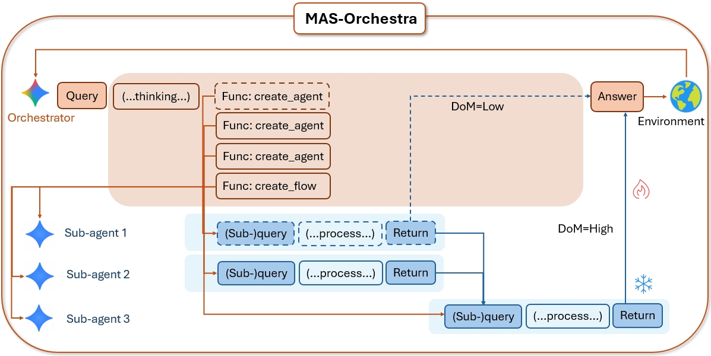

<div align="center">

<h1 align="center">
  <!--  -->
  MAS-Orchestra: Understanding and Improving Multi-Agent Reasoning Through Holistic Orchestration and Controlled Benchmarks
</h1>
<!-- #  Absolute Zero:  Reinforced Self-play Reasoning with Zero Data -->

[](https://github.com/SalesforceAIResearch/MAS-Orchestra/blob/main/MAS_Orchestra.pdf)    [](https://vincent950129.github.io/mas-design/index.html)    [](https://github.com/SalesforceAIResearch/MAS-Orchestra)    [](https://huggingface.co/datasets/Salesforce/MASBench)

<div align="center" style="font-family: Arial, sans-serif;">
  <p>
    <a href="#news" style="text-decoration: none; font-weight: bold;">🎉 News</a> •
    <a href="#links" style="text-decoration: none; font-weight: bold;">🔗 Links</a> •
    <a href="#todo" style="text-decoration: none; font-weight: bold;">📝 Conceptual Overview</a> •
    <!-- <a href="#algorithm-flow" style="text-decoration: none; font-weight: bold;">⚙️ Algorithm Flow</a> • -->
    <a href="#results" style="text-decoration: none; font-weight: bold;">📊 Results</a>
  </p>
  <p>
    <a href="#getting-started" style="text-decoration: none; font-weight: bold;">✨ Getting Started</a> •
    <a href="#training" style="text-decoration: none; font-weight: bold;">🏋️ MAS-Orchestra</a> •
    <!-- <a href="#usage" style="text-decoration: none; font-weight: bold;">🔧 Usage</a> • -->
    <!-- <a href="#evaluation-code" style="text-decoration: none; font-weight: bold;">📃 Evaluation</a> -->
  </p>
  <p>
    <a href="#citation" style="text-decoration: none; font-weight: bold;">🎈 Citation</a> •
    <a href="#acknowledgement" style="text-decoration: none; font-weight: bold;">🌻 Acknowledgement</a> •
    <a href="#contact" style="text-decoration: none; font-weight: bold;">📧 Contact</a>
    <!-- <a href="#star-history" style="text-decoration: none; font-weight: bold;">📈 Star History</a> -->
  </p>
</div>

</div>



<!-- ============================================== -->

<!-- ============================================== -->
<div align="left">
  <h1 id="links">🔗 Links</h1>
  <hr style="height: 3px; background: linear-gradient(90deg, #EF8E8D, #5755A3); border: none; border-radius: 3px;">
</div>

- 🏠 [[Project Page]](https://mas-design.github.io/)
- 📜 [[Paper]](https://github.com/SalesforceAIResearch/MAS-Orchestra/blob/main/MAS_Orchestra.pdf)
- 💻 [[Code]](https://github.com/SalesforceAIResearch/MAS-Orchestra)

<!-- ============================================== -->
<div align="left">
  <h1 id="getting-started">✨ Getting Started</h1>
  <hr style="height: 3px; background: linear-gradient(90deg, #EF8E8D, #5755A3); border: none; border-radius: 3px;">
</div>

## 🎄 Environment Setup
```bash
conda create -n mas-orchestra python==3.10
conda activate mas-orchestra

apt update && apt install -y wget curl

cd ./verl
./install.sh
pip install --no-deps -e .
pip install ray==2.49.2 --force-reinstall
pip install protobuf==4.25.8 --force-reinstall
pip install together
pip install math-verify[antlr4_13_2]
pip install antlr4-python3-runtime==4.9.3

pip install langchain-core langchain-together langchain-community duckduckgo-search tavily-python pydantic ddgs langchain_brightdata bs4
pip install pyserini faiss-gpu
pip install git+https://github.com/texttron/tevatron.git

```

<!-- ## 💾 Data Processing
### Process evaluation data on CruxEval / LiveCodeBench Execution during AZR Self-play
```bash
python -m absolute_zero_reasoner.data_construction.process_code_reasoning_data
``` -->

<!-- ============================================== -->
<div align="left">
  <h1 id="training">🏋️ MAS-Orchestra</h1>
  <hr style="height: 3px; background: linear-gradient(90deg, #EF8E8D, #5755A3); border: none; border-radius: 3px;">
</div>

## ♟️ Example Training Script
<!-- 3b models need 2 X 80gb GPUs, 7/8b models need 4 X 80gb, 14b requires 8 X 80gb
```bash
bash scripts/selfplay/<7b|14b|coder3b|coder7b|coder14b|llama>.sh
``` -->
```bash
export OPENAI_API_KEY={YourKey}
export TOGETHER_API_KEY={YourKey}
export WANDB_API_KEY={YourKey}
LOG_FILE={YourLogFile}

python -u -m mas_r1_reasoner.main_mas_r1 \
    --config-path=configs \
    --config-name=grpo_trainer \
    data.max_prompt_length=15000 \
    data.max_validation_prompt_length=15000 \
    data.val_files=data/browse_comp/test_subset_200.parquet \
    data.train_files=data/browse_comp/train_subset_1066.parquet \
    azr.mas_r1.use_llm_judge=True \
    data.raw_data=True \
    data.train_batch_size=64 \
    actor_rollout_ref.rollout.n=32 \
    azr.mas_r1.execution_success_weight=0.0 \
    azr.mas_r1.final_answer_weight=1.0 \
    azr.mas_r1.agent.model_name=gpt-oss-120b\
    azr.mas_r1.multiply_processes=0 \
    azr.mas_r1.max_ray_workers=1 \
    azr.problem_type=harmony_medium \
    azr.mas_r1.agent.init_archive=['COT','COT_SC','Reflexion','LLM_debate','WebSearch'] \
    trainer.val_before_train=True \
    trainer.test_freq=5 \
    trainer.save_freq=10 \
    actor_rollout_ref.model.path=Qwen/Qwen2.5-7B-Instruct \
    trainer.experiment_name=harmony_medium_grpo_7b_gpt_oss_120b_browse_comp_plus \
    $@ 2>&1 | tee -a "$LOG_FILE"
```

<!-- ============================================== -->
<div align="left">
  <h1 id="citation">🎈 Citation</h1>
  <hr style="height: 3px; background: linear-gradient(90deg, #EF8E8D, #5755A3); border: none; border-radius: 3px;">
</div>

If you find MAS-Orchestra helpful, please consider starring this repo and citing our work. We would be very grateful!

```bibtex
@misc{Ke2026MASOrchestra,
        title        = {MAS-Orchestra: Understanding and Improving Multi-Agent Reasoning Through Holistic Orchestration and Controlled Benchmarks},
        author       = {Zixuan Ke and Yifei Ming and Austin Xu and Ryan Chin and Xuan-Phi Nguyen and Prathyusha Jwalapuram and Semih Yavuz and Caiming Xiong and Shafiq Joty},
        year         = {2026},
        eprint       = {2601.14652},
        archivePrefix= {arXiv},
        primaryClass = {cs.AI},
        note         = {Preprint; Work in Progress},
      }
```

<!-- ============================================== -->
<div align="left">
  <h1 id="acknowledgement">🌻 Acknowledgement</h1>
  <hr style="height: 3px; background: linear-gradient(90deg, #EF8E8D, #5755A3); border: none; border-radius: 3px;">
</div>
<!-- This project received help from many researchers at Salesforce AI Research. The code is adapted from the [ADAS](https://github.com/ShengranHu/ADAS). During development, we also referred to [simple-evals](https://github.com/openai/simple-evals), [MaAS](https://github.com/bingreeky/MaAS), and [AFlow](https://github.com/FoundationAgents/AFlow).   -->

This project received help from many researchers at Salesforce AI Research. We also thank thanks to the authors of the [verl](https://github.com/volcengine/verl) for their excellent contributions to the community!

<!-- ============================================== -->
<div align="left">
  <h1 id="contact">📧 Contact</h1>
  <hr style="height: 3px; background: linear-gradient(90deg, #EF8E8D, #5755A3); border: none; border-radius: 3px;">
</div>

Feel free to contact Zixuan Ke via email: zixuan.ke@salesforce.com

<!-- ============================================== -->
<!-- <div align="left">
  <h1 id="star-history">📈 Star History</h1>
  <hr style="height: 3px; background: linear-gradient(90deg, #EF8E8D, #5755A3); border: none; border-radius: 3px;">
</div> -->

<!-- [](https://www.star-history.com/#LeapLabTHU/Absolute-Zero-Reasoner&Date) -->
